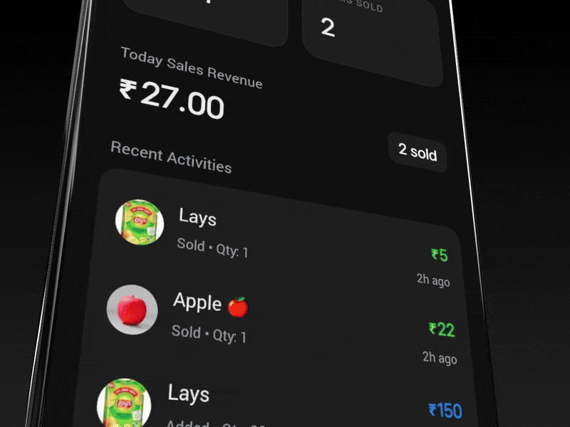

# InVo – Master README (All-In-One Documentation) 🚀

Modern, AI-powered inventory management built with React Native (Expo), TypeScript, and SQLite. This README is the single source of truth for setup, architecture, features, workflows, build, troubleshooting, and operational details.

[](https://github.com/Rakesh-ada/InVo/releases/latest)
[](https://github.com/Rakesh-ada/InVo/releases/latest/download/invo-android.apk)
[](https://expo.dev/@Rakesh-ada/invo)

 <p>
   
 </p>

## Contents

- Overview
- Features (Product, POS, Suppliers, AI, Reports)
- Architecture & Directory Reference
- Data Model (SQLite schema)
- Services (database, AI, vector store, analytics cache, reports)
- App Screens & UX
- Environment & Configuration
- Development (run, debug, test-like checks)
- Build & Release (Expo/EAS, Android)
- Performance & Size Optimization
- Security & Privacy
- Troubleshooting & FAQ
- Maintenance & Contribution

## Overview

InVo helps small businesses track products, sales, and suppliers, with AI-assisted insights and weekly reporting. It is offline-first and stores data locally using SQLite.

## Features

- Dashboard: KPIs, low/out-of-stock signals, quick actions
- Products: CRUD, unit, expiry, pricing, image URI
- POS (Explore): Cart, stock checks, sales posting, QR payment flow
- Suppliers: Directory, order builder, call/WhatsApp actions
- AI Chat: Gemini-backed insights using semantic context (RAG)
- Weekly Report: In-app generated PDF summary
- Settings: Business profile and QR payment image

### Smart Dashboard

- Real-time analytics: inventory metrics, sales performance, insights
- Interactive charts and customizable metrics
- Low stock alerts and out-of-stock tracking

### Product Management

- Complete lifecycle: add, edit, delete, track
- Image support, expiry dates, buying/selling price, units, stock levels
- Bulk operations and fast search/filter

### Point of Sale (POS)

- Cart with quantity controls and stock validation
- QR code payment flow, sales processing, basic receipt concept
- Tracks payment completion and updates inventory + sales

### AI-Powered Intelligence

- AI insights, demand forecasting, stock optimization, alerts
- Profitability analysis and simple business intelligence
- Natural language queries powered by Gemini

### Supplier Management

- Supplier directory and contact details
- Order builder with chips/suggestions
- Call and WhatsApp actions

### Advanced Reporting

- Weekly report generation with charts and alerts (PDF via Expo)
- Sales analytics and inventory reports

### Settings & Configuration

- Business profile
- QR payment image configuration

## Architecture & Directory Reference

- `app/`: Screens via Expo Router (tabs + standalone screens)
- `components/`: Reusable UI (icons, charts, cards)
- `services/`: Core logic and data access
  - `database.ts`: SQLite access, schema, CRUD, sales tracking
  - `gemini.ts`: AI chat orchestration, RAG, prompt shaping
  - `vector-store.ts`: Lightweight embeddings + semantic search
  - `analytics-cache.ts`: Cached KPIs with TTL
  - `weekly-report.ts`: PDF report generator (Expo Print/Sharing)
- `assets/`: Images and fonts
- `android/`: Native Android config and build output (Gradle)

Key screens

- `app/(tabs)/dashboard.tsx` – metrics and quick actions
- `app/(tabs)/products.tsx` – product management
- `app/(tabs)/explore.tsx` – POS/cart and payment modal
- `app/supplier-order.tsx` – supplier order builder with search
- `app/weekly-report.tsx` – weekly analytics
- `app/ai-chat.tsx` – AI assistant (Gemini)

### Screens & Navigation

Main Tabs

1. Dashboard – Overview of business metrics and quick actions
2. Products – Product management interface
3. Explore – POS and cart
4. Settings – App configuration

Additional Screens

- AI Chat – Assistant for insights
- Suppliers – Management and orders
- Weekly Report – Analytics
- Onboarding – First-time setup

## Data Model (SQLite)

Tables are created automatically on first run.

- `products(id, name, buyingPrice, sellingPrice, quantity, unit, expiryDate, imageUri, addedDate)`
- `sales(id, productId, quantitySold, totalAmount, saleDate)`
- `suppliers(id, name, phoneNumber, whatsappNumber, email, addedDate)`
- `cart_items(id, name, qty, price)`

Indexes

- `idx_products_name` on `products(name)`
- `idx_products_addedDate` on `products(addedDate)`

Migrations

- `unit` column auto-added when missing. `DatabaseService` includes retries, health checks, and a `resetDatabase()` utility for schema mismatches.

## Services

- Database (`services/database.ts`)
  - Robust init with retries; CRUD for products and suppliers
  - Sales tracking (`recordSale`, listing, daily totals)
  - Health + stats helpers, bulk insert, search
- AI (`services/gemini.ts`)
  - Uses `EXPO_PUBLIC_GEMINI_API_KEY`
  - Builds enhanced prompts with: semantic context, cached analytics, and sales
  - Read-only assistant; includes backoff/retry for 503s and streaming simulation
- Vector Store (`services/vector-store.ts`)
  - Simple 128-dim embeddings persisted in `AsyncStorage`
  - Regeneration on version change; cosine similarity search
- Analytics Cache (`services/analytics-cache.ts`)
  - TTL-based cache for KPIs (products, stock, value, margins)
- Weekly Report (`services/weekly-report.ts`)
  - Generates a polished PDF with metrics, charts, and alerts via Expo Print/Sharing

## App Screens & UX Notes

- POS safeguards inventory: prevents adding over stock, validates at payment, updates inventory and records sales, stores a daily summary in `AsyncStorage(@daily_sales_data)` for dashboard.
- Supplier Order includes a header search toggle and suggestion chips to quickly add items.
- Payment Modal supports a QR image from Settings; nice success animation and Done button.

## Environment & Configuration

Create `.env` with:

```
EXPO_PUBLIC_GEMINI_API_KEY=your_gemini_api_key
```

Other storage keys

- `@invo_settings`: JSON with `businessName`, `qrPaymentImageUri`
- `@daily_sales_data`: array used by dashboard/analytics

## Development

Prerequisites

- Node 18+, npm
- Expo CLI
- Android Studio (emulator) or a device with Expo Go

Install & Run

```
   npm install
   npx expo start
   ```

Useful scripts

- Dev: `npx expo start -c` (clean cache)
- Android: `npm run android` (if defined) or press `a` in Expo CLI

TypeScript & Lint

- TS config at `tsconfig.json`; ESLint at `eslint.config.js`

## Build & Release

Using EAS (recommended)

```
# Login once
eas login

# Configure
eas build:configure

# Production Android build (APK/AAB per eas.json)
eas build --platform android --profile production
```

Artifacts appear in the EAS dashboard. Native Gradle project is present under `android/` for advanced configuration (ProGuard/R8 enabled by default in release).

## Download & Install

Pre-built Applications

- Android APK: [Download Latest APK](https://github.com/Rakesh-ada/InVo/releases/tag/v2.5/Invo_2.5.apk)
- iOS App: Coming soon
- Expo Go: [Try in Expo Go](https://expo.dev/@Rakesh-ada/invo)

Direct Downloads

- Latest Release: [Releases](https://github.com/Rakesh-ada/InVo/releases/latest)
- All Releases: [All Downloads](https://github.com/Rakesh-ada/InVo/releases)

## Performance & Size Optimization

- R8/ProGuard code shrinking and obfuscation for Android release
- Asset trimming and compression; avoid unused images
- UI rendering optimized with React hooks and memoization where needed
- Lightweight vector store and cached analytics to reduce DB load

## Security & Privacy

- All business data is stored locally on-device (SQLite/AsyncStorage)
- No cloud dependency required for core features
- API key is public-scope (Expo) and used client-side for Gemini; treat accordingly

## Troubleshooting & FAQ

- App opens but data doesn’t appear
  - Try clearing Metro cache: `npx expo start -c`
  - Reinstall app to reset local DB
- Database schema errors (e.g., missing columns)
  - Call `dbService.resetDatabase()` from a temporary button/handler in dev
- Gemini errors / overloaded
  - Service retries with backoff; ensure `EXPO_PUBLIC_GEMINI_API_KEY` is valid
- Android build too large
  - Ensure release build with R8; remove unused assets

## Maintenance & Contribution

Branching

- `master` is stable; feature branches via PRs

Code Style

- TypeScript-first; clear variable names; shallow control flow; meaningful error logs

PR Checklist

- Focused changes, TS-safe, no linter errors, tested on device/emulator

License

- MIT (add a LICENSE file if distributing)

—

InVo – Effortless Inventory Mastery

## Business Benefits

Efficiency Gains

- Faster inventory ops, real-time insights, automated alerts, AI recommendations

Cost Savings

- Reduce waste via expiry tracking, optimize pricing, prevent overstocking

Growth Support

- Scalable architecture, advanced analytics, supplier management, professional reporting

## Contributing

We welcome contributions. Suggested flow:

1. Fork repository
2. Create feature branch
3. Implement and test changes
4. Open a pull request

## Acknowledgments

- Expo Team
- React Native Community
- Google Gemini
- Open Source contributors
